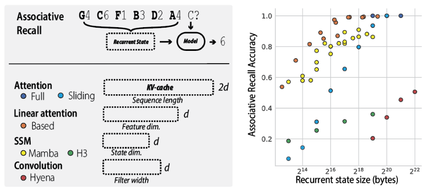

<div align="center" >
     

**Simple linear attention language models balance the recall-throughput tradeoff.**

[](https://img.shields.io/github/license/HazyResearch/meerkat)
[](https://github.com/pre-commit/pre-commit)


</div>


Based is an efficient architecture that approximates attention with linear attention to model long-range dependencies in the sequence plus short (i.e. dimension 64) sliding window attention to model fine-grained local dependencies in the sequence. In this repo, we are including code to train new models and to eval existing checkpoints on downstream tasks.

## Installation

**Note.** The code in this repository is tested on `python=3.8.18` and `torch=2.1.2`. We recommend using these versions in a clean environment. 

```bash
# clone the repository
git clone git@github.com:HazyResearch/based.git
cd based

# install torch
pip install torch==2.1.2 torchvision==0.16.2 torchaudio==2.1.2 --index-url https://download.pytorch.org/whl/cu118 # due to observed causal-conv1d dependency

# install based package
pip install -e .
```

## Pretrained Checkpoints

We are releasing the following checkpoints for research, trained at the 360M and 1.3Bn parameter scales. Each checkpoint is trained on the same 10Bn tokens of the Pile corpus, using the same data order. The checkpoints are trained using the same code and infrastructure.  

Use the code below to load any of the checkpoints:
```python  
from transformers import AutoTokenizer
from based.models.gpt import GPTLMHeadModel

tokenizer = AutoTokenizer.from_pretrained("gpt2")
model = GPTLMHeadModel.from_pretrained_hf("hazyresearch/based-360m").to("cuda")
```


| *Architecture* | *Size* | *Tokens*| *WandB* | *HuggingFace* | *Config* |
| ---          | ---  | ---   | ---   | --- | --- |
| **Based**        | 360m | 10b   |[02-20-based-360m](https://wandb.ai/hazy-research/based/runs/02-20-based-360m) |[hazyresearch/based-360m](https://huggingface.co/hazyresearch/based-360m)     |reference/based-360m.yaml |
| **Based**        | 1.4b | 10b   |[02-21-based-1b](https://wandb.ai/hazy-research/based/runs/02-24-based-1b)     |[hazyresearch/based-1b](https://huggingface.co/hazyresearch/based-1b)      |reference/based-1b.yaml |
| **Attention**    | 360m | 10b   |[02-21-attn-360m](https://wandb.ai/hazy-research/based/runs/02-21-attn-360m-redo1) |[hazyresearch/attn-360m](https://huggingface.co/hazyresearch/attn-360m)     |reference/attn-360m.yaml |
| **Attention**    | 1b | 10b   |[02-25-attn-1b](https://wandb.ai/hazy-research/based/runs/02-25-attn-1b) |[hazyresearch/attn-1b](https://huggingface.co/hazyresearch/attn-1b)     |reference/attn-360m.yaml |
| **Mamba**        | 360m | 10b   |[02-21-mamba-360m](https://wandb.ai/hazy-research/based/runs/02-21-mamba-360m) |[hazyresearch/mamba-360m](https://huggingface.co/hazyresearch/mamba-360m)     |reference/mamba-360m.yaml |
| **Mamba**        | 1.4b | 10b   |[02-22-mamba-1b](https://wandb.ai/hazy-research/based/runs/02-22-mamba-1b) |[hazyresearch/mamba-1b](https://huggingface.co/hazyresearch/mamba-1b)     |reference/mamba-1b.yaml |


**Warning.** We are releasing these models for the purpose of efficient architecture research. Because they have not been instruction fine-tuned or audited, they are not intended for use in any downstream applications. 

You can try running a simple text generation with the following. 
```python
input = tokenizer.encode("If I take one more step, it will be", return_tensors="pt").to("cuda")
output = model.generate(input, max_length=20)
print(tokenizer.decode(output[0]))
```

**Note.** for the checkpoints from other models, you will need to install other dependencies. 

To use the Transformer and Mamba checkpoints, you will need the following installations:
```bash
# transformer
pip install flash_attn

# mamba
pip install mamba-ssm
```


## Train
In order to train a new model with our code, you'll need to do a bit more setup: 
```python
# install train extra dependencies
pip install -e .[train]

# install apex
git clone https://github.com/NVIDIA/apex
cd apex
pip install -v --disable-pip-version-check --no-cache-dir --no-build-isolation --config-settings "--build-option=--cpp_ext" --config-settings "--build-option=--cuda_ext" ./
cd ..
```

To train a new model, construct a config.yaml file at ```based/configs/experiment/```. We are including the configs used to produce the pretrained checkpoints for the paper (released on HF below) at ```based/configs/experiment/reference/```.

You can launch a training job using the following command from the ```based/based/``` directory, where you can modify the config name and number of GPUs (```trainer.devices```):
```python run.py experiment=reference/based-1.3b trainer.devices=8```


## Evaluate
In our paper, we evaluate pretrained language models on standard suite of benchmarks from the LM Evaluation Harness as well as a new suite of three *recall-intensive* tasks:

- **SWDE** (Info. extraction). A popular information extraction benchmark for semi-structured data. SWDE includes raw HTML docuemtns from 8 Movie and 5 University websites (e.g.IMDB, US News) and annotations for 8-274 attributes per website (e.g., Movie runtime). **HuggingFace: [hazyresearch/based-swde](https://huggingface.co/datasets/hazyresearch/based-swde)**
- **FDA** (Info. extraction). A popular information extraction benchmark for unstructured data. The FDA setting contains 16 gold attributes and 100 PDF documents, which are up to 20 pages long, randomly sampled from FDA 510(k). **HuggingFace: [hazyresearch/based-fda](https://huggingface.co/datasets/hazyresearch/based-swde)**
- **SQUAD-Completion** (Document-QA). We find that original SQUAD dataset is challenging for our models without instruction fine-tuning. So we introduce a modified version of SQUAD where questions are reworded as next-token prediction tasks. For example, "What is the capital of France?" becomes "The capital of France is". **HuggingFace: [hazyresearch/based-squad](https://huggingface.co/datasets/hazyresearch/based-swde)**

Under `evaluate`, we have a clone of EleutherAI's [lm-evaluation-harness](https://github.com/EleutherAI/lm-evaluation-harness) that includes these new tasks and provides scripts for running all the evaluations from the paper. The following instructions can be used to reproduce our results on the [LM-Eval harness](https://github.com/EleutherAI/lm-evaluation-harness) using the pretrained checkpoints.


### Setup.
TODO: Update this. 
```bash
cd evaluate 

# init the submodule and install
git submodule init
git submodule update
pip install -e . 
```


### Evaluations.

```
cd evals/
bash run_harness.sh
```


## Experiments on Synthetic Data
In our paper, we demonstrate the recall-throughput tradeoff using a synthetic associative recall task (see Figure 2, below, and Figure 3 in the paper). 
<div align="center" >
     
</div>

The code for reproducing these figures is provided in a separate repository: [HazyResearch/zoology](https://github.com/HazyResearch/zoology). Follow the setup instruction in the Zoology README. The instructions for reproducing the are provided in [zoology/experiments](https://github.com/HazyResearch/zoology/tree/main/zoology/experiments). For example, you can create the figure above using. 

```
python -m zoology.launch zoology/experiments/arxiv24_based_figure2/configs.py -p
```

## Citation and Acknowledgements
```
```


This project was made possible by a number of other open source projects. Notably:
- Our training code and sliding window implementation are based on Tri Dao's [FlashAttention](https://github.com/Dao-AILab/flash-attention). 
- We use EleutherAI's [lm-evaluation-harness](https://github.com/EleutherAI/lm-evaluation-harness) for evaluation. 

Models in this project were trained using compute provided by:  
- [Together.ai](https://www.together.ai/)
- Google Cloud Platform through [Stanford HAI](https://hai.stanford.edu/call-google-cloud-credit-proposals)
